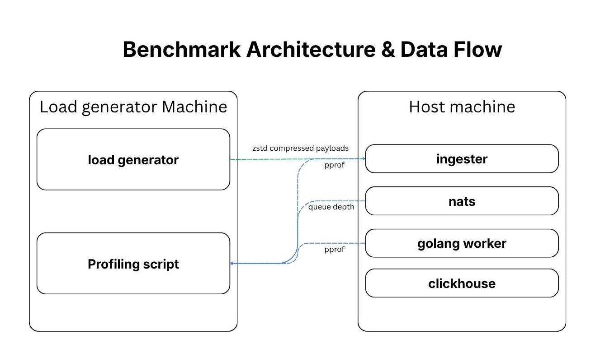

# Logarithm — Performance Benchmarks

> All benchmarks are reproducible. Load generator configs are in `load_generator/configs/` and profiling scripts in `load_generator/`. <br>
> M1 results were collected on 14 June 2026 at commit `bench-m1` (0d4aba89527fbb191b5061210e2180ac7c9683c7). <br>
> M2 results were collected on 24 June 2026 at commit `bench-m2` (55e996a06fa37cebc60ba81310c4f04bdb674170). <br>
> To reproduce, see [Reproducing Results](#reproducing-results).

---

## Table of Contents

1. [System Specifications](#system-specifications)
2. [Benchmarking Methodology](#benchmarking-methodology)
3. [What We Measure and Why](#what-we-measure-and-why)
4. [Baseline Configuration](#baseline-configuration)
5. [Results: Ingestion Latency](#results-ingestion-latency)
6. [Results: Throughput Ceiling](#results-throughput-ceiling)
7. [Results: NATS Queue Depth](#results-nats-queue-depth)
8. [Reproducing Results](#reproducing-results)

---

## System Specifications

Benchmarks involve two machines: a **host** running the full ingestion engine, and a **load
generator** sending HTTP requests. Separating these ensures the load generator is never the
bottleneck and that network overhead reflects a realistic deployment scenario.

### Host Machine (Ingestion Engine)

Runs all Docker containers: ingestion server, NATS JetStream, Go worker, ClickHouse.

| Component | Specification |
|---|---|
| OS | Ubuntu 26.04 LTS |
| CPU | AMD Ryzen 5 5600X (6C / 12T) |
| RAM | 16 GB DDR4 @ 3200 MHz (Dual-Channel) |
| Storage | 1 TB NVMe SSD |
| Network | 1 Gbps Direct P2P Onboard Ethernet |

### Load Generator Machine (Client)

Runs the Vegeta-based load generator only.

| Component | Specification |
|---|---|
| OS | macOS Sonoma |
| CPU | Apple M3 Pro |
| RAM | 18 GB Unified Memory |
| Network | 1 Gbps Direct P2P Ethernet (via USB-C adapter) |

### Network

| Property | Value |
|---|---|
| Connection type | Direct P2P Ethernet (no router / switch) |
| Approximate RTT between machines | ~1ms|

### Software Versions

| Component | Version |
|---|---|
| Go | 1.25 |
| NATS | 2.14 |
| ClickHouse | 26.3 |
| Docker (host) | 29.5.3 |
| Vegeta (client) | 12.13.0 |

---

## Benchmarking Methodology

### Milestone Definitions

Results are recorded across three milestones reflecting the evolution of the system:

| Milestone | Description |
|---|---|
| **M1** | HTTP ingestion, JSON payloads only. No optimisations|
| **M2** | HTTP ingestion with support for protobuf payloads + performance optimisations from M1 |
| **M3** | M2 + gRPC ingestion path added |

### Load Generator

Payloads are generated using a custom Go load generator built on the [Vegeta](https://github.com/tsenart/vegeta) library, which provides precise rate control and built-in latency percentile reporting on the client side.

Payload generation is config-driven via JSON files under `load_generator/config.json`. Each config specifies a seed, batch size, RPS, duration, log severity distribution, and whether payloads are gzip-compressed. Using a fixed `seed: 42` ensures identical byte sequences are generated across runs, making cross-milestone comparisons valid.

Compressed payloads: The config.json files allow specification of an `encoding` field which accepts `zstd`, `gzip` or `none` for payload compression. For consistency, all tests will be run with `zstd` compressed payloads.

### Warmup

Each run includes a warmup phase at the target RPS before the measured window begins. <br> This allows HTTP connection pools, and internal service connection pools to reach a steady state.

### Profiling

`pprof` is exposed on both the ingestion server (`:6060`) and worker (`:6061`) via the
`ENABLE_PPROF=true` environment variable. Profiling is automated by `load_generator/profile.sh`, which captures the following during the measured window:

| Profile | Component | Purpose |
|---|---|---|
| CPU profile | Ingester + Worker | Where CPU time is spent |
| Execution trace | Ingester + Worker | Goroutine scheduling and GC events |
| Block profile | Ingester + Worker | Goroutine blocking on channel / lock |
| Mutex profile | Ingester + Worker | Mutex contention |
| Heap diff (before -> after) | Ingester + Worker | Net heap growth under load |
| Allocation profile | Ingester + Worker | Cumulative allocation sites |
| Goroutine snapshot | Ingester + Worker | Goroutine leak check |

NATS consumer `NumPending` is also polled every second throughout the run and written to
`queue_depth.csv`.

<a href="./assets/">
  
</a>

---
## What Is Measured and Why

### Ingestion Server Latency

**What:** p99 HTTP response latency from the client's perspective, at the baseline RPS. Measured by Vegeta.

**Why:** The ingestion server returns as soon as the payload is buffered to NATS, clients do not wait for ClickHouse. This is the core promise of the async-decoupled architecture. p99 latency is particularly important because it tells us what the tail end latency is for request sending clients.

### Throughput Ceiling

**What:** The highest sustained RPS at which p99 latency remains below 100ms, or the first RPS level at which the NATS queue depth does not stabilise - whichever comes first.

**Why:** This is the hard operational limit of the pipeline. Beyond it, clients experience degraded response times or the worker falls irreversibly behind. Comparing the ceiling across milestones shows the concrete impact of each optimisation.

### NATS Consumer Queue Depth (`NumPending`)

**What:** Time-series of messages in the JetStream stream not yet delivered to the durable
consumer, polled at 1-second intervals.

**Why:** A stabilising `NumPending` confirms the worker drains the queue faster than the ingestion rate. Unbounded growth means the worker is the pipeline bottleneck which results in accumulated requests in nats over time.

---

## Baseline Configuration

All cross-milestone comparisons use a single fixed baseline config. **RPS is fixed between milestone runs** — the same config is used for M1, M2, and M3 so that latency deltas are attributable solely to code changes. 
- `protocol` can be swapped between `http` or `grpc` to test the respective transport protocols.
- `contentType` can be swapped between `proto` or `json` to marshal the payloads accordingly.
- `grpc_workers` is used for `grpc` protocol only and similarly `http_method` and `http_healthUrl` is used for `http` protocol only. 

```json
{
  "seed": 42,
  "poolSize": 500000,
  "protocol": "http",
  "grpc_workers": 5,
  "http_method": "POST",
  "http_healthUrl": "http://HOST_IP:8090/health",
  "targetUrl": "http://HOST_IP:8090/ingest",
  "contentType":"proto",
  "encoding": "zstd",
  "rps": 1000,
  "duration": "60s",
  "batchSize": 100,
  "severityDistribution": [0.1, 0.6, 0.1, 0.1, 0.1],
  "serviceNames": [
    "testservice1",
    "testservice2",
    "testservice3",
    "testservice4"
  ],
  "bodyTokens": {
    "min": 5,
    "max": 5,
    "dictionary": [
      "failed", "process", "transaction", "invalid", "account",
      "timeout", "database", "connection", "lost", "retry",
      "success", "user", "authenticated", "payload", "too", "large"
    ]
  },
  "resourceAttributes": [
    { "key": "host.name",    "value": "prod-payment-02" },
    { "key": "environment",  "value": "production" }
  ],
  "logAttributes": [
    { "key": "http.method",  "value": "POST" }
  ]
}
```

### Ceiling Discovery/Max Throughput

To find the throughput ceiling for each milestone, the baseline config is run at increasing RPS steps (e.g. 1000 -> 2000 -> 3000 -> 4000 -> 5000+) until p99 exceeds 100ms or `NumPending` does not stabilise. Results are recorded in the [Throughput Ceiling](#results-throughput-ceiling) section.

---

## Results: Ingestion Latency

Measured at baseline RPS (1,000) for each milestone. This holds RPS constant so that latency
changes are directly attributable to code optimisations, not load changes.

| Milestone | Transport| p99/ms |
|---|---|---|
| M1: JSON bytes | HTTP | 2.88 |
| M2: JSON bytes | HTTP | 1.48 |
| M2: protobuf bytes | HTTP | 2.24 |
| M3: JSON bytes | HTTP | |
| M3: protobuf bytes | HTTP | |
| M3: protobuf bytes| gRPC | |

---

## Results: Throughput Ceiling

The ceiling is identified by stepping RPS up incrementally until p99 exceeds 100ms or Nats Queue depth grows without stabilising. 

<table>
<tr>
<td valign="top" width="33%">

### M1: HTTP, JSON bytes

| RPS |p99/ms | Queue Stabilised? |
|---|---|---|
| 1,000 | 2.88 | Yes |
| 2,000 | 3.66 | Yes |
| 2,500 | 4.73 | No |
| 3,000 | 4.97 | No |
| **Ceiling** | 3.66 | Yes |

</td>

<td valign="top" width="33%">

### M2: HTTP, JSON bytes

| RPS | p99/ms | Queue Stabilised |
|-----|-----|-------------------|
| 1,000 | 1.48 | Yes |
| 2,000 | 1.14 | Yes |
| 3,000 | 1.22 | Yes |
| 3,500 | 1.32 | Yes |
| 4,000 | 1.55 | No |
| **Ceiling** | 1.32 | Yes |

</td>

<td valign="top" width="33%">

### M2: HTTP, protobuf bytes

| RPS | p99/ms | Queue Stabilised |
|-----|-----|-------------------|
| 1,000 | 2.24 | Yes |
| 2,000 | 0.96 | Yes |
| 3,000 | 1.08 | Yes |
| 4,000 | 1.17 | Yes |
| 5,000 | 1.35 | Yes |
| 5,500 | 1.59 | No |
| **Ceiling** | 1.35 | Yes |

</td>

</tr>
</table>

<table>
<tr>
<td valign="top" width="33%">

### M3: HTTP, JSON bytes
| RPS | p99/ms | Queue Stabilised |
|---|---|---|
| 1,000 | | |
| 2,000 | | |
| 3,000 | | |
| 4,000 | | |
| 5,000 | | |
| **Ceiling** | — | — |

</td>

<td valign="top" width="33%">

### M3: HTTP, protobuf bytes
| RPS | p99/ms | Queue Stabilised |
|---|---|---|
| 1,000 | | |
| 2,000 | | |
| 3,000 | | |
| 4,000 | | |
| 5,000 | | |
| **Ceiling** | — | — |

</td>

<td valign="top" width="33%">

### M3: GRPC, protobuf bytes
| RPS | p99/ms | Queue Stabilised |
|---|---|---|
| 1,000 | | |
| 2,000 | | |
| 3,000 | | |
| 4,000 | | |
| 5,000 | | |
| **Ceiling** | — | — |

</td>

</tr>
</table>

### Ceiling Summary
| Milestone | Transport | Payload | Ceiling RPS | p99 at Ceiling/ms |
|---|---|---|---|---|
| M1 | HTTP | JSON | 2000 | 3.66 |
| M2 | HTTP | JSON | 3500 | 1.32 |
| M2 | HTTP | Protobuf | 5000 | 1.35 |
| M3 | HTTP | JSON | | |
| M3 | HTTP | Protobuf | | |
| M3 | gRPC | Protobuf | | |

> _Insert graph: side-by-side p99 latency distribution — HTTP vs gRPC at ceiling RPS._

---

## Results: NATS Queue Depth

`NumPending` polled at 1-second intervals during the ceiling RPS run for each milestone.
A stabilising curve confirms the worker drains the queue faster than the ingestion rate.

| Milestone |Transport | Payload | Peak NumPending at Max Throughput|
|---|---|---|---|
| M1 | HTTP | JSON | 798 |
| M2 | HTTP | JSON | 0 |
| M2 | HTTP | protobuf | 1049 |
| M3 | HTTP | JSON | |
| M3 | HTTP | protobuf | |
| M3 | gRPC | protobuf | |

<p align="center">
  <a href="./assets/">
    
    
    
  </a>
</p>

---

## Reproducing Results

### Prerequisites

- Docker and Docker Compose on the host machine
- Go 1.25+ on the load generator machine
- `jq` installed on the load generator machine
- Both machines connected via direct Ethernet

### Steps

**On the host machine:**
```bash
# clear linux cache before every run
sync; echo 3 | sudo tee /proc/sys/vm/drop_caches
```


```bash
# allow socket recycling 
sudo sysctl -w net.ipv4.tcp_tw_reuse=1 

# increase max number of queued connections
sudo sysctl -w net.core.somaxconn=65535

```

```bash
# 1. Clone the repository
git clone https://github.com/Eddrick-23/Logarithm.git && cd Logarithm

# 2. Start the full Logarithm service
docker compose -f docker-compose.benchmark.yml up -d --build

# 3. Verify all services are healthy
docker compose ps
```

**On the load generator machine:**

```bash
# 4. Clone the repository
git clone https://github.com/Eddrick-23/Logarithm.git
cd Logarithm/load_generator

# 5. Run a benchmark (60s run, 10s warmup, 10s rest, baseline config)
bash profile.sh 60 10 10 configs/config_baseline.json HOST_IP

# 6. Results are written to:
# load_generator/benchmark_results
```

### Profile Analysis

After a run, `profile.sh` prints the exact `go tool pprof` commands to analyse each profile.

### Environment Variables

| Variable | Default | Description |
|---|---|---|
| `ENABLE_PPROF` | `false` | Expose pprof on `:6060` (ingester) and `:6061` (worker) |

This is set automatically by `docker-compose.bench.yml`. Do not enable `ENABLE_PPROF` in production.
